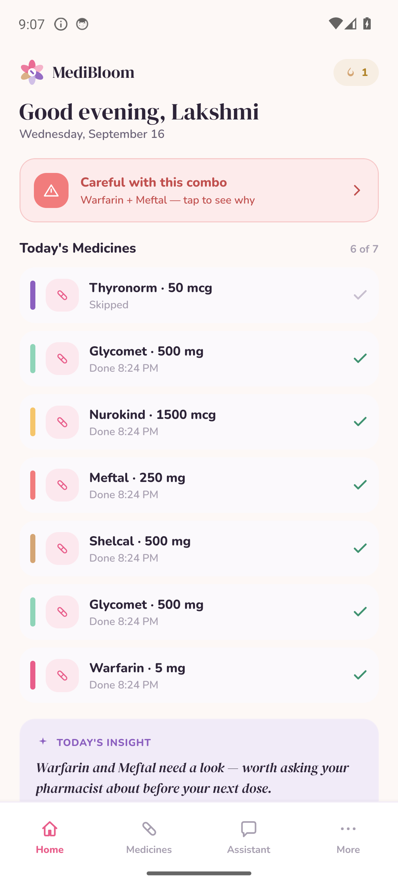
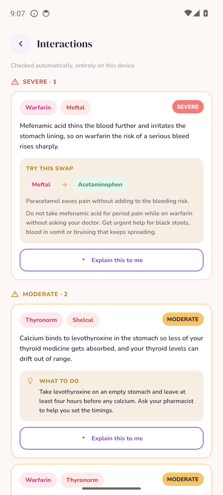
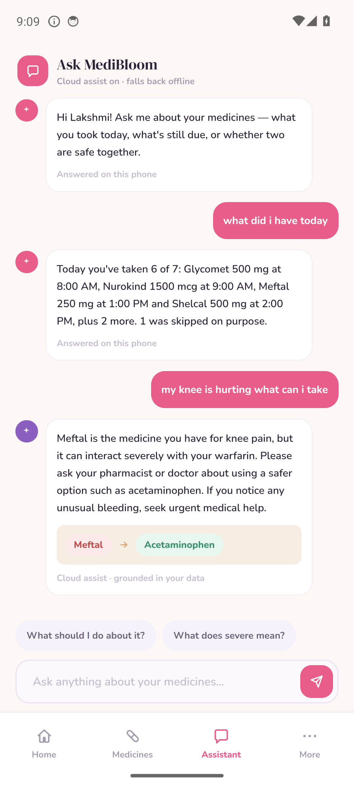
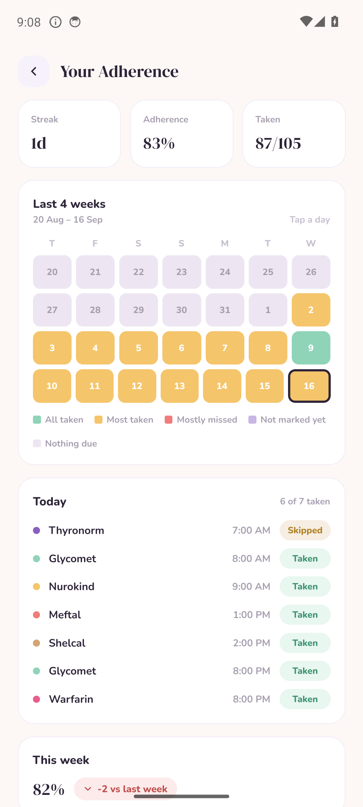
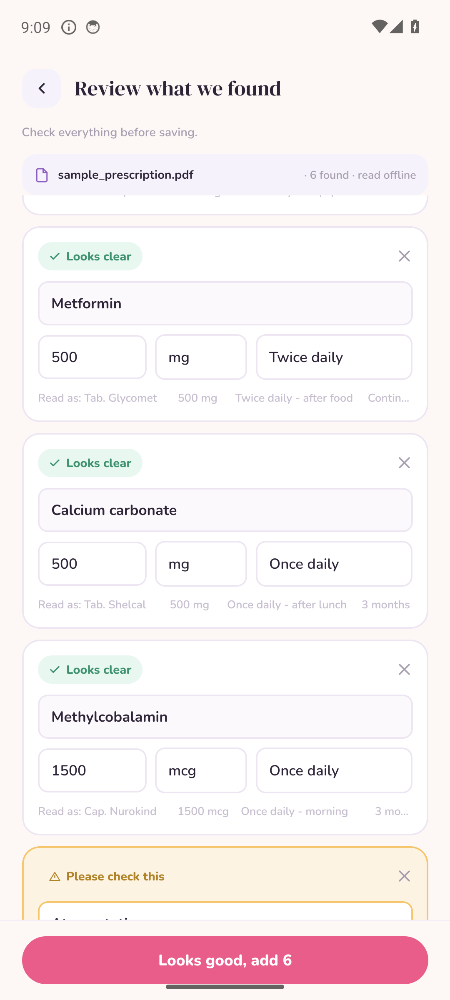
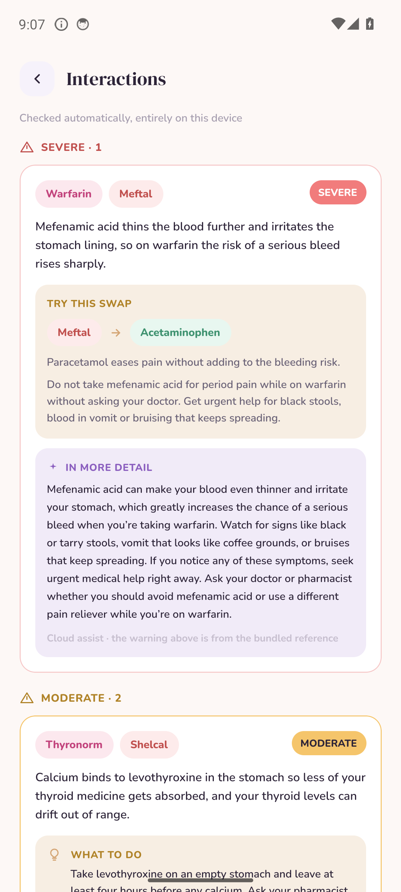
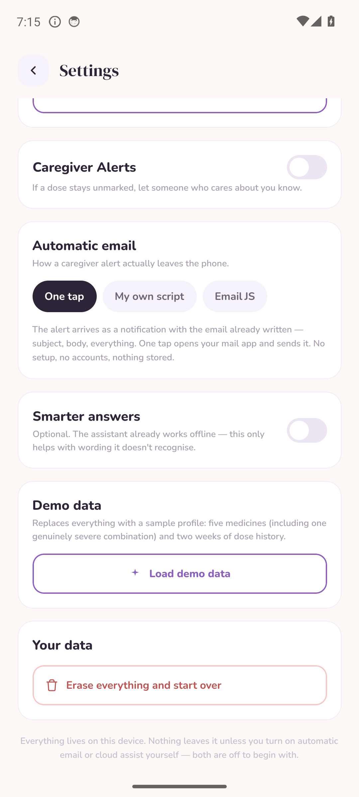

<div align="center">


# MediBloom

### Your medicines, remembered. Your safety, checked.

**An offline-first Android app that checks every pair of your medicines for dangerous
interactions, reminds you when doses are due, and explains the risk in plain language.**

<br />


</div>

---

## 🩺 The problem

> Roughly **half** of all long-term medicine is not taken as prescribed.
> Taking **five or more** medicines — normal for an older adult — roughly **doubles**
> the risk of a harmful reaction.

In India much of that medicine is bought over the counter, so no single doctor or
pharmacist ever sees the whole list. A grandmother on warfarin buys Meftal for her
knee at the medical shop. Nobody checks. That combination causes serious bleeding.

Existing apps don't close the gap:

| What exists | Why it isn't enough |
|---|---|
| 💊 **Reminder apps** | Tell you *when* to take something. Never *whether* it's safe. |
| 🌐 **Interaction checkers** | Need the internet, are written in clinical English, built for pharmacists. |
| 🏥 **Hospital systems** | Only know what *they* prescribed — not the strip bought down the road. |

**MediBloom does both, offline, in words a 68-year-old can act on.**

---

## 📱 Screenshots

<div align="center">

<table>
<tr>
<td align="center" width="25%"><br /><b>Home</b><br /><sub>Today's doses, live interaction banner, an insight generated from the real dose log</sub></td>
<td align="center" width="25%"><br /><b>Interactions</b><br /><sub>Severity, plain-language explanation, and a Smart Swap that names the safer option</sub></td>
<td align="center" width="25%"><br /><b>Assistant</b><br /><sub>Offline answers from your own log; open-ended questions go to an optional model</sub></td>
<td align="center" width="25%"><br /><b>Adherence</b><br /><sub>Streak, tappable four-week calendar, week-on-week trend, per-medicine breakdown</sub></td>
</tr>
<tr>
<td align="center"><br /><b>Prescription scan</b><br /><sub>On-device OCR. It shows what it read and asks before saving anything</sub></td>
<td align="center"><br /><b>Explain this to me</b><br /><sub>Optional AI detail, with the bundled rule still shown above it</sub></td>
<td align="center"><br /><b>Settings</b><br /><sub>Reminders, caregiver alerts, automatic email and cloud assist — all opt-in</sub></td>
<td align="center" valign="middle"><sub><b>Demo profile</b><br /><br />Lakshmi, 68, Chennai.<br />Warfarin, Thyronorm, Shelcal,<br />Glycomet, Nurokind —<br />and Meftal bought<br />over the counter.<br /><br />Three real interactions,<br />one of them severe.</sub></td>
</tr>
</table>

</div>

---

## ✨ Features

### 🔴 Interaction checking
Every pair of your medicines is re-checked the instant you add one, against **134 bundled
rules** covering **130 generic drugs**. **398 brand-name mappings** weighted to Indian
pharmacy names mean you can type what's printed on the strip — *Shelcal*, *Meftal*,
*Thyronorm*, *Dolo 650* — instead of the chemical name.

### 🟢 Smart Swap
Where a safer alternative exists, the app names it. **19 rules** carry one. The direction is
enforced in code and in tests: it swaps the *painkiller*, never the medicine keeping you alive.

### 🔔 Reminders that actually work
Android notifications with **Mark taken / Snooze 10m / Skip** on the notification itself —
one tap from the lock screen, straight into the database. Exact alarms, survive a reboot.
The time picker is built from big **+** and **−** buttons because a spinner is useless to
someone with shaky hands.

### 📷 Prescription scanning
Photograph a prescription or pick a PDF. **Google ML Kit** reads it on the phone, the parser
extracts names, doses and frequencies, and resolves brands to generics. Anything it isn't
sure about is flagged **"Please check this"** with suggestions — it never silently guesses a
drug name. PDFs are rasterised by a small Kotlin module built on Android's own `PdfRenderer`.

### 👨‍👩‍👧 Caregiver alerts
If a dose stays unmarked past your chosen limit (1, 2, 4 or 8 hours), the app writes the
email — which medicine, what time, how long — and sends it to a family member. Automatically
if you've set up a free relay; otherwise one tap from a notification.

### 💬 Ask MediBloom
A chat that answers from *your* data. **"What did I have today?"** is answered instantly on
the phone. It understands time — *yesterday evening*, *last week*, *3 days ago*, *on Monday*
— through a small NLU layer, with **no model and no network**. Open-ended questions like
*"my knee is hurting, what can I take"* can go to a free AI model.

### 📊 Wellness dashboard
Streak, adherence percentage, a tappable four-week calendar where any day opens that day's
doses, week-on-week comparison, and a per-medicine breakdown — all derived from your own log.

### ♿ Accessibility
Not a checkbox — the brief. Larger-text mode that scales the whole type system, voice
read-aloud, touch targets ≥44px, colour never the only signal, plain words everywhere
("Careful with this combo", not "Contraindication"), and **nothing to log into, ever**.

---

## 🧠 How it works

```
┌──────────────────────── the phone ────────────────────────┐
│                                                           │
│  12 screens  ──►  AppStore (React context)                │
│                        │                                  │
│                        ▼                                  │
│              ┌──── pure engines ────┐                     │
│              │ interactions  nlu    │  no RN/Expo imports │
│              │ assistant     parser │  → unit-testable    │
│              │ insights      schedule                     │
│              └──────────┬───────────┘                     │
│                         │                                 │
│     ┌───────────────────┼───────────────────┐             │
│     ▼                   ▼                   ▼             │
│  SQLite            AlarmManager          ML Kit           │
│  (all data)        (reminders)           (OCR)            │
│                                                           │
└─────────────────────────┬─────────────────────────────────┘
                          │ optional, opt-in, fails soft
                          ▼
              Groq  ·  EmailJS / Google Apps Script
```

**Remove the bottom box entirely and the app still does its job.** Interaction checking,
reminders, the dose log, the schedule, adherence and the assistant's factual answers all
live above the line.

### Rules answer what they can. A model answers the rest.

Most assistants send everything to a model. We measured it and that was the wrong call —
it added ~10 seconds and once rendered a **skipped** dose as *"you took it"*, which you
cannot ship in a medication app.

| | Answered on the phone | Sent to a model |
|---|---|---|
| **What** | What you took, what's left, next dose, adherence, streak, your schedule, interaction checks | Open-ended questions, plain-language explanations, OCR second opinion |
| **Speed** | Instant | ~10 seconds |
| **Network** | None | Required |
| **On failure** | — | Falls back to the rules, and says so |

The split is a boolean on the answer object (`AssistantAnswer.exact`) and it's unit-tested.

---

## 🛠 Tech stack

<table>
<tr><th align="left">Layer</th><th align="left">Choice</th><th align="left">Why</th></tr>
<tr><td><b>Framework</b></td><td>React Native 0.86 · Expo SDK 57</td><td>One codebase, real native alarms and camera access</td></tr>
<tr><td><b>Language</b></td><td>TypeScript, <code>strict</code></td><td>The engines are pure logic — types catch what tests miss</td></tr>
<tr><td><b>Navigation</b></td><td>React Navigation 7</td><td>Bottom tabs + native stack</td></tr>
<tr><td><b>Database</b></td><td><code>expo-sqlite</code></td><td>On the phone. The only place data lives</td></tr>
<tr><td><b>Reminders</b></td><td><code>expo-notifications</code></td><td>Daily triggers on Android AlarmManager, with action buttons</td></tr>
<tr><td><b>OCR</b></td><td>Google ML Kit</td><td>Runs fully offline, ships with Play Services, costs nothing</td></tr>
<tr><td><b>PDF rendering</b></td><td>Custom Expo module (Kotlin)</td><td>The third-party library was unmaintained; we wrapped Android's <code>PdfRenderer</code></td></tr>
<tr><td><b>Secrets</b></td><td><code>expo-secure-store</code></td><td>Android Keystore — API keys never touch the database or the source</td></tr>
<tr><td><b>Graphics</b></td><td><code>react-native-svg</code></td><td>Every icon and the logo are hand-drawn SVG — no icon font</td></tr>
<tr><td><b>Typography</b></td><td>DM Serif Display + Nunito</td><td>Self-hosted via <code>@expo-google-fonts</code>, works offline</td></tr>
<tr><td><b>Speech</b></td><td><code>expo-speech</code></td><td>Reads the medicine and dose aloud</td></tr>
<tr><td><b>Testing</b></td><td>Jest + ts-jest</td><td>221 tests; engines have no native imports so they need no mocking</td></tr>
<tr><td><b>Build</b></td><td>Gradle signed release APK</td><td>Standalone — no Metro, no dev server</td></tr>
</table>

### Optional external services — all free, all off by default

| Service | Used for | Cost |
|---|---|---|
| **Groq** (`openai/gpt-oss-120b`) | Open-ended assistant answers, interaction explanations, OCR second pass | Free tier |
| **Google AI Studio** / **OpenRouter** | Alternative AI providers | Free tier |
| **EmailJS** | Sending caregiver alerts automatically | Free — 200/month |
| **Google Apps Script** | Alternative: sends through the user's own Gmail | Free |

> **None of these are required.** With no AI key the assistant answers from its own rules.
> With no email relay the caregiver alert arrives as a notification with the email already
> written, one tap from sending.

---

## 🚀 Getting started

```bash
git clone <this-repo>
cd MediBloom/app
npm install
```

Run it on a connected device or emulator:

```bash
npx expo run:android
```

Build the standalone signed APK:

```bash
# one-time: create a keystore
keytool -genkeypair -v -storetype PKCS12 \
  -keystore app/credentials/medibloom-release.keystore \
  -alias medibloom -keyalg RSA -keysize 2048 -validity 10000

# one-time: record the passwords (this file is gitignored)
cat > app/credentials/signing.env <<'EOF'
MEDIBLOOM_KEY_ALIAS=medibloom
MEDIBLOOM_STORE_PASSWORD=your-password
MEDIBLOOM_KEY_PASSWORD=your-password
EOF

bash scripts/build-release-apk.sh     # → MediBloom.apk
```

Tests and typecheck:

```bash
cd app
npx jest            # 221 tests
npx tsc --noEmit
```

Regenerate assets — both are built from source so they can't drift:

```bash
python scripts/generate-icons.py          # launcher icon from the same SVG as the in-app logo
python scripts/generate-prescriptions.py  # the five demo prescriptions
python scripts/generate-deck.py           # the pitch deck
python scripts/generate-doc-pdf.py        # the documentation PDF
```

### Trying it out

Open **Settings → Load demo data**. That loads Lakshmi, 68, from Chennai — six medicines
and two weeks of history, with three genuine interactions including one severe.

---

## 📁 Project structure

```
app/
├── src/
│   ├── data/           interaction rules, brand synonyms, types, demo seed
│   ├── db/             SQLite schema + repositories
│   ├── engines/        pure logic — nlu, assistant, interactions, insights, schedule, parser
│   ├── services/       notifications, OCR, caregiver alerts, optional AI, email relay
│   ├── hooks/          keyboard height
│   ├── screens/        12 screens
│   ├── components/     UI kit, hand-drawn icon set, settings cards
│   ├── state/          app store
│   └── theme/          design tokens + provider
├── modules/pdf-render/ local Expo module (Kotlin) wrapping Android PdfRenderer
└── __tests__/          221 logic tests

demo-prescriptions/     5 fictional prescriptions (HTML + PDF + PNG)
docs/screenshots/       the images in this README
scripts/                toolchain setup, build, secret scan, asset generation
```

---

## 🔒 Security & privacy

- **All health data stays on the device.** SQLite, three tables, no account, no analytics,
  no tracking, no server to breach.
- **No credentials in this repository.** `app/src/data/defaults.ts` ships empty on purpose.
  API keys are entered in the app's Settings screen and stored in the **Android Keystore**.
- **Keystores and signing passwords are gitignored** — `app/credentials/` never leaves your machine.
- **A secret scanner runs before every commit** once you enable it:

  ```bash
  git config core.hooksPath .githooks   # blocks commits containing keys
  bash scripts/check-secrets.sh         # or run it manually
  ```

The only data that can ever leave the phone is a short factual summary sent with an AI
question, or a caregiver email — both opt-in, both labelled in the UI.

---

## ✅ How we know it works

**221 automated tests**, plus the signed release APK driven on a real device over `adb`:

- Reminder fires on time; Mark taken writes to the database and Home updates
- Warfarin + Meftal flagged **severe** before the medicine is even saved
- Sample prescription parsed — all six Indian brands resolved to generics
- A deliberate misread flagged *"Please check this"*, never guessed
- Cloud assist answered a free-form question in 13 seconds, safely
- Invalid API key → chat still answered on-device and explained why
- Clean logcat across every screen: no crashes, no JS errors

<details>
<summary><b>Three bugs our own testing caught</b></summary>

<br />

1. **A splash screen that never hid.** `hideAsync` sat in an `onLayout` callback that fired
   before SQLite finished opening, so it did nothing and never fired again. The app looked
   frozen and silently swallowed every tap.
2. **41 brand names silently failed to resolve** — Crestor, Losar, Aten, Allegra — because
   their generic appeared in no interaction rule. Recognising a drug and having nothing to
   warn about are different things; the code was conflating them.
3. **A swap chip that read "Warfarin → Paracetamol"** — telling a patient to replace her
   anticoagulant with a painkiller. The rule's a/b order was backwards. Now barred in code,
   with a test that stops any of 17 critical drugs ever being the swap target.

</details>

---

## ⚠️ Honest limitations

- **The interaction dataset is hand-built, not certified.** 134 well-established rules,
  written for this project. It needs pharmacist review before real patients, and it skews
  severe (73 of 134) because we concentrated on bleeding, serotonin, potassium and QT risks.
- **Handwriting OCR is unreliable** — by design the app shows what it read and asks, rather
  than guessing a drug name.
- **Some Android manufacturers throttle background alarms** unless the app is exempted from
  battery optimisation. Known Android-wide problem.
- **Cloud assist sends data off the phone** when you switch it on. Optional and labelled.
- **No cross-device sync**, deliberately. Health data that never leaves the device can't be breached.

---

## 🗺 Roadmap

**Next**
- Pharmacist review of all 134 rules — the one thing between this and real patients
- Tamil, Hindi and Telugu — the UI is already written in plain language
- Shared caregiver dashboard — a read-only weekly view, still no account for the patient

**Beyond**
- On-device small language model, so open-ended answers work offline too
- Pharmacy and ABDM integration, so the dispensed list arrives automatically
- Refill prediction and dose-timing suggestions that avoid the clashes we detect

---

## ⚕️ Disclaimer

MediBloom provides general medication-safety support. **It does not diagnose, prescribe, or
replace a doctor or pharmacist.** In an emergency, contact your local emergency services.
The patients, hospitals, doctors and prescriptions in the demo data are fictional and
watermarked accordingly.

<div align="center">
<br />
<sub>Built for a healthtech & wellness hackathon · works in airplane mode · ₹0 to run, forever</sub>
</div>
